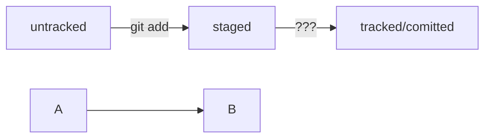

#Шпаргалка
------------
[DocsGitHub](https://docs.github.com/ru) - документация по Github
[markdown](https://markdown-here.com/livedemo.html) - демо
[GIT](https://git-scm.com/book/ru/v2/%D0%9E%D1%81%D0%BD%D0%BE%D0%B2%D1%8B-Git-%D0%A1%D0%BE%D0%B7%D0%B4%D0%B0%D0%BD%D0%B8%D0%B5-Git-%D1%80%D0%B5%D0%BF%D0%BE%D0%B7%D0%B8%D1%82%D0%BE%D1%80%D0%B8%D1%8F) -GIT
##Базовые команды в консоли

####Навигация

- `pwd` (от англ. ***p**rint **w**orking **d**irectory*, «показать рабочую папку») — покажи, в какой я папке;
- `ls` (от англ. ***l**i**s**t directory contents*, «отобразить содержимое директории») — покажи файлы и папки в текущей папке;
- `ls -a` — покажи также скрытые файлы и папки, названия которых начинаются с символа `.`;
- `cd first-project` (от англ. ***c**hange **d**irectory*, «сменить директорию») — перейди в папку `first-project`;
- `cd first-project/html` — перейди в папку `html`, которая находится в папке `first-project`;
- `cd ..` — перейди на уровень выше, в родительскую папку;
- `cd ~` — перейди в домашнюю директорию (`/Users/Username`);
- `cd /` — перейди в корневую директорию
#### Работа с файлами и папками
**Создание**

- `touch index.html` (англ. *touch,* «коснуться») — создай файл `index.html` в текущей папке;
- `touch index.html style.css script.js` — если нужно создать сразу несколько файлов, можно напечатать их имена в одну строку через пробел;
- `mkdir second-project` (от англ. ***m**a**k**e **dir**ectory*, «создать директорию») — создай папку с именем `second-project` в текущей папке.

**Копирование и перемещение**

- `cp file.txt ~/my-dir` (от англ. ***c**o**p**y*, «копировать») — скопируй файл в другое место;
- `mv file.txt ~/my-dir` (от англ. ***m**o**v**e*, «переместить») — перемести файл или папку в другое место.

**Чтение**

- `cat file.txt` (от англ. *con**cat**enate and print*, «объединить и распечатать») — распечатай содержимое текстового файла `file.txt`.

**Удаление**

- `rm about.html` (от англ. ***r**e**m**ove*, «удалить») — удали файл `about.html`;
- `rmdir images` (от англ. ***r**e**m**ove **dir**ectory*, «удалить директорию») — удали папку `images`;
- `rm -r second-project` (от англ. ***r**e**m**ove,* «удалить» + ***r**ecursive*, «рекурсивный») — удали папку `second-project` и всё, что она содержит.
###Git
- `git config --global user.name "[имя]"` Устанавливает имя, которое будет отображаться в поле автора у выполняемых вами коммитов
- `git config --global user.email "[адрес электронной почты]"` Устанавливает адрес электронной почты, который будет отображаться в информации о выполняемых вами коммитах
- `git init [название проекта] `Создаёт новый локальный репозиторий с заданным именем
- `git add [файл]` Индексирует указанный файл для последующего коммита
- `git add .`подготовили к сохранению все файлы в репозитории
- `git status` посмотреть состояние (статус) репозитория
- `git commit -m "Мой первый коммит!"` происходит само сохранение. `-m` от англ. message — «сообщение»), который присваивает коммиту сообщение.
- `git log` Просмотреть историю коммитов.
- `cd [путь]` перейдите в каталог локального репозитория и введите команду
- `git remote add origin git@github.com:%ИМЯ_АККАУНТА%/first-project.git` связывает локальную с удаленой
- `git remote -v` Убедиться, что репозитории связаны
- `git push -u origin master` В первый раз эту команду нужно вызвать с флагом `-u` и параметрами `origin` (имя удалённого репозитория) и  master (название текущей ветки). Флаг `-u` свяжет локальную ветку с одноимённой удалённой.
- `git push ` далее писать просто
###изменения последнего коммита 
- `git commit --amend --no-edit`С опцией `--amend` команда `commit` не создаст новый коммит, а дополнит последний. Обратите внимание на опцию `--no-edit`. Она сообщает команде `commit`, что сообщение коммита нужно оставить как было.
- `git commit --amend -m "Добавить главную страницу и стили"`
`--amend` рассчитан на работу с последним коммитом (HEAD).
Дополнить коммит новыми файлами можно с помощью `git commit --amend --no-edit`. Благодаря опции `--no-edit` сообщение к коммиту останется таким, каким и было.
Изменить сообщение к коммиту позволяет команда `git commit --amend -m` "Обновлённое сообщение коммита". 
###Откат
- `git restore --staged example.txt`Убрать файл из staging поможет команда git restore `--staged <file>` (от англ. restore — «восстановить»).
- `git reset --hard <commit hash>` вернуть состояние репозитория к более раннему. Пример `git reset --hard b576d89`
- 'git restore <file>` «Откатить» изменения, которые не попали ни в staging, ни в коммит
Команда `git restore --staged <file>` переведёт файл из staged обратно в modified или untracked.
Команда `git reset --hard <commit hash>` «откатит» историю до коммита с хешем <hash>. Более поздние коммиты потеряются!
Команда `git restore <file> «откатит»` изменения в файле до последней сохранённой (в коммите или в staging) версии.
###изменения
- `git diff` сравнит последнюю закоммиченную версию файла с той, что находится в состоянии modified.
- `git diff --staged` окажет изменения в staged-файлах относительно последних закоммиченных версий.
- `git diff <коммит1> <коммит2>` сравнивать изменения в двух коммитах.
######SSH-ключ
`cd ~`  перешли в домашнюю директорию 
`ls -la .ssh/`  вывели список созданных кsлючей 
`ssh-keygen -t ed25519 -C` "электронная почта, к которой привязан ваш аккаунт на GitHub"
`ls -a ~/.ssh `проверить, что ключи действительно сгенерировались
`clip < ~/.ssh/id_ed25519.pub `скопировать содержимое ключа в буфер обмена:
###изменения

#### nano
`ctrl+x`exit-save
####vim
`Esc->:qa!->enter` exit
